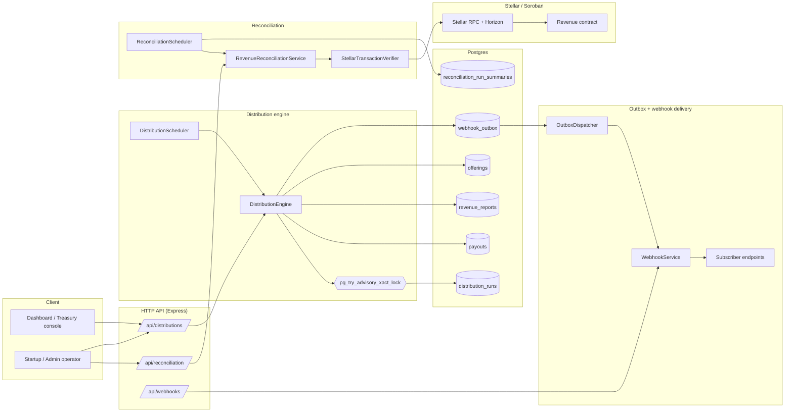
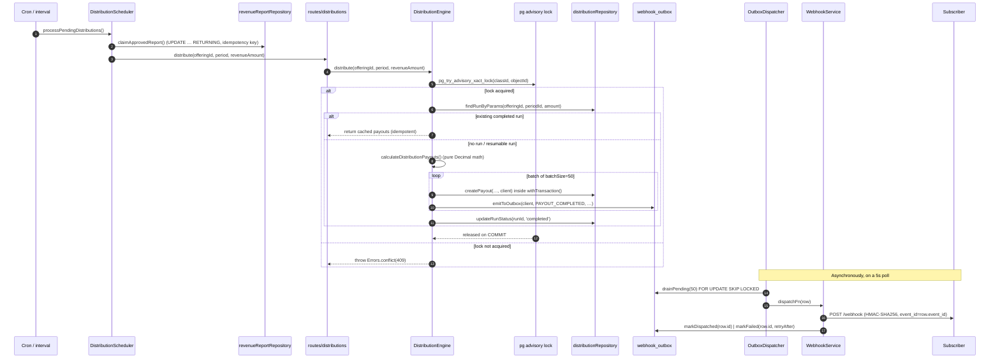
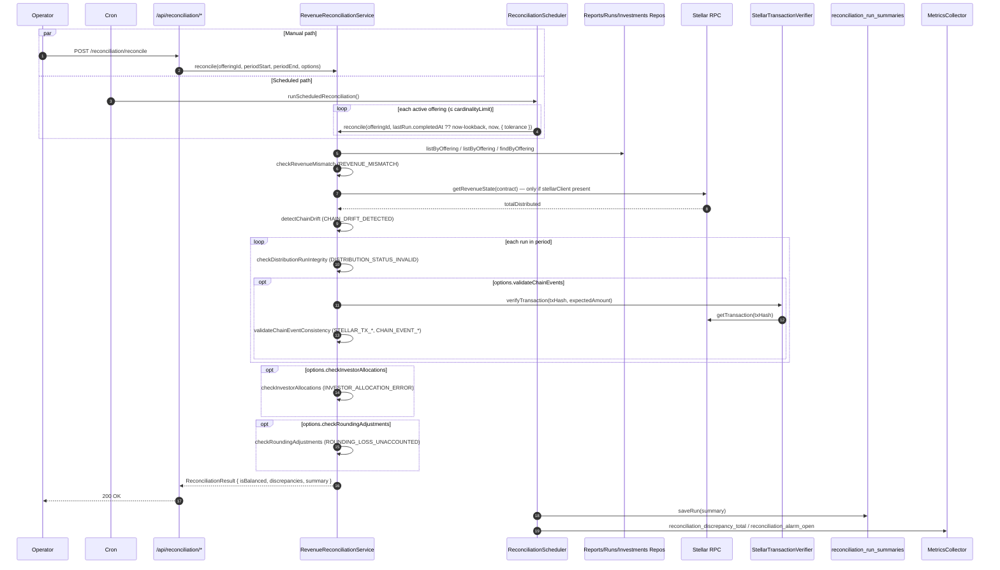
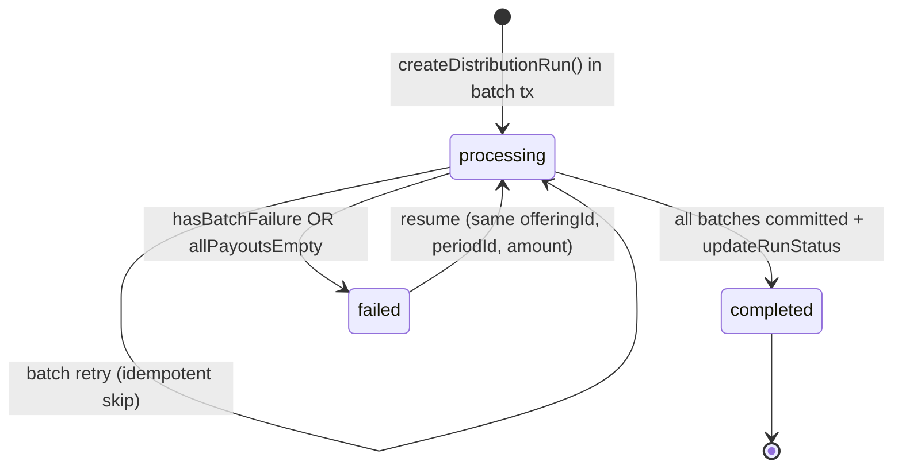
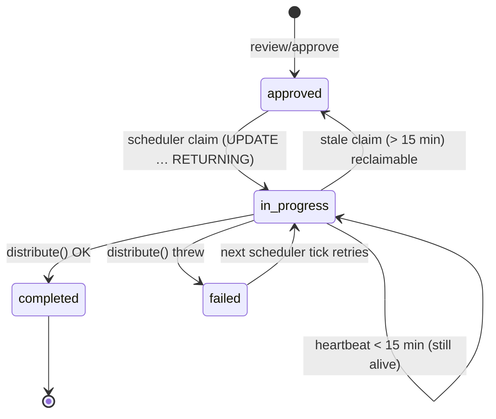
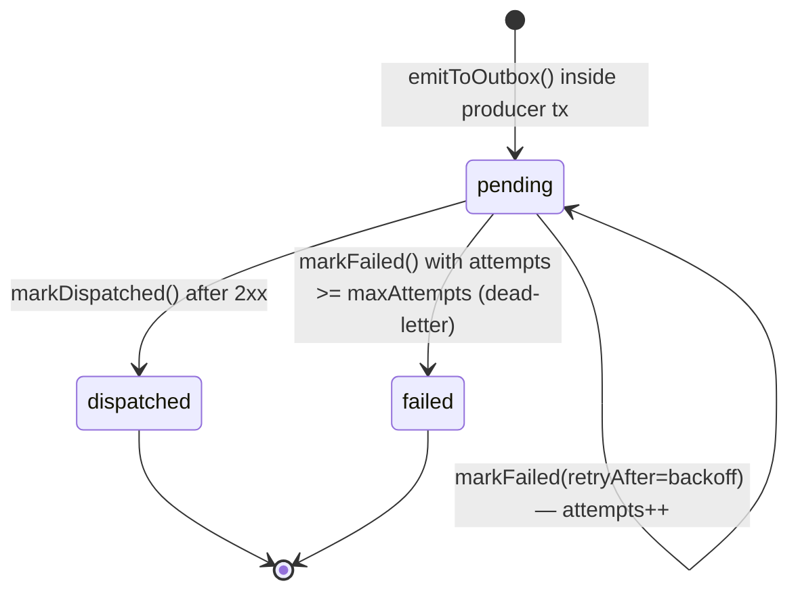
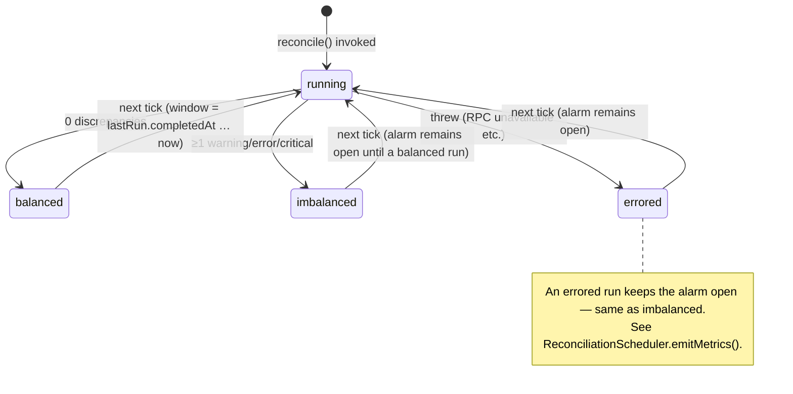

# Distribution & Reconciliation Architecture

> **Authoritative end-to-end map** of how offerings, revenue reports, the
> distribution engine, the reconciliation service, and the transactional webhook
> outbox interlock. Every flow diagram in this document is rendered from a
> committed Mermaid source block, so it can be diff-reviewed and regenerated
> deterministically.
>
> This document is updated **in the same PR** as the code change it describes.
> Until that PR lands, the **code is authoritative** and this document may be
> stale; if you spot a divergence, file an issue or open a follow-up doc PR
> alongside the fix.

---

## 1. Subsystem map

The five logical subsystems and their primary files:

| Subsystem | Primary code | Primary doc |
|---|---|---|
| Offerings (catalog) | `src/services/offeringSyncService.ts`, `src/db/repositories/offeringRepository.ts` | `docs/offering-validation-matrix.md`, `docs/offering-status-transition-guardrails.md` |
| Revenue reports | `src/services/revenueService.ts`, `src/db/repositories/revenueReportRepository.ts` | `docs/revenue-report-ingestion-validation.md` |
| Distribution engine | `src/services/distributionEngine.ts`, `src/services/distributionScheduler.ts`, `src/routes/distributions.ts`, `src/db/repositories/distributionRepository.ts` | `docs/distribution-engine-retry-strategy.md`, `docs/distribution-advisory-lock.md`, `docs/distribution-engine-atomic-transactions.md`, `docs/distribution-scheduler-idempotency.md`, `docs/distribution-engine-safety.md` |
| Reconciliation | `src/services/revenueReconciliationService.ts`, `src/services/reconciliationScheduler.ts`, `src/routes/reconciliationRoutes.ts` | `docs/revenue-reconciliation.md`, `docs/revenue-reconciliation-checks.md`, `docs/stellar-rpc-failure-behavior.md` |
| Transactional webhook outbox | `src/services/outboxDispatcher.ts`, `src/services/webhookService.ts`, `src/db/repositories/outboxRepository.ts` | `docs/transactional-outbox.md`, `docs/webhooks-implementation.md`, `docs/webhook-queue-backpressure.md` |

---

## 2. End-to-end sequence — distribution run

This is the canonical flow from "approved revenue report" to "all payouts
written and webhook delivered". Every block corresponds to a real method in the
codebase; cross-links are inline.

### Idempotency invariants

1. **Report claim** — `DistributionScheduler` atomically transitions
   `revenue_reports.distribution_status` from `NULL` / `failed` / stale
   `in_progress` to `in_progress`. A second scheduler sees no row and skips.
2. **Distribution lock** — `pg_try_advisory_xact_lock` keyed on
   `(offeringId, periodId)` prevents two concurrent runners from double-paying.
   See [`distribution-advisory-lock.md`](../distribution-advisory-lock.md).
3. **Run idempotency** — the engine looks up
   `findRunByParams(offeringId, periodId, amount)`; a `completed` run returns
   cached payouts verbatim.
4. **Outbox stability** — the `webhook_outbox.event_id` is generated inside the
   producer's transaction and forwarded as the webhook payload `id` field, so
   retries are receiver-deduplicatable.

---

## 3. End-to-end sequence — reconciliation

Two entry points run the same `RevenueReconciliationService.reconcile()` core:

### Alarm semantics

`ReconciliationScheduler` raises the **dead-letter alarm** gauge for an offering
if any scheduled run is imbalanced **or errors**. A subsequent balanced run
clears the alarm. Overflow offerings (beyond `cardinalityLimit`, default 50)
share a single `offering_id="overflow"` label to keep Prometheus cardinality
bounded.

---

## 4. State machines

### 4.1 `distribution_runs.status`

Resumption is keyed on `(offeringId, periodId, amount)`. Calling `distribute()`
again with the same triple returns the existing run + cached payouts.

### 4.2 `revenue_reports.distribution_status`

### 4.3 `webhook_outbox.status`

### 4.4 Reconciliation `isBalanced`

---

## 5. Database tables and ownership

| Table | Owned by | Written from | Read from |
|---|---|---|---|
| `offerings` | Offering sync | `offeringSyncService`, `offeringRepository` | All services needing offering metadata |
| `revenue_reports` | Treasury | `revenueService`, `revenueReportRepository` | `DistributionScheduler`, `RevenueReconciliationService` |
| `distribution_runs` | Engine | `distributionRepository` (via `DistributionEngine`) | `RevenueReconciliationService`, `/api/distributions` |
| `payouts` | Engine | `distributionRepository` (inside batch tx) | `RevenueReconciliationService.checkPayoutCompleteness` |
| `webhook_outbox` | Engine + services | `webhookService.emitToOutbox()` inside producer tx | `outboxRepository.drainPending()` |
| `reconciliation_run_summaries` | Scheduler | `ReconciliationScheduler.runStore.saveRun()` | `runStore.getLastRun()` (window calculation) |
| `idempotency_keys` | Engine | `DistributionEngine.fanOutNotifications` | (deduplicates notification fan-out) |

Migrations that introduce the tables above live in `src/db/migrations/`. Any
new column on one of these tables must be referenced from this document in the
same PR.

---

## 6. Cross-reference matrix

| Service / file | Cross-links to |
|---|---|
| `src/services/distributionEngine.ts` | [retry strategy](../distribution-engine-retry-strategy.md), [advisory lock](../distribution-advisory-lock.md), [atomic transactions](../distribution-engine-atomic-transactions.md), [safety & idempotency](../distribution-engine-safety.md), [error mapping](../structured-error-mapping.md) |
| `src/services/distributionScheduler.ts` | [scheduler idempotency](../distribution-scheduler-idempotency.md), [holiday calendar](../holiday-calendar-service.md), [advisory lock](../distribution-advisory-lock.md) |
| `src/services/revenueReconciliationService.ts` | [reconciliation overview](../revenue-reconciliation.md), [checks spec](../revenue-reconciliation-checks.md), [Stellar RPC failure taxonomy](../stellar-rpc-failure-classification.md) |
| `src/services/reconciliationScheduler.ts` | [prometheus metrics](../prometheus-metrics-endpoint.md), [metrics baseline](../metrics-and-logging-baseline.md) |
| `src/services/outboxDispatcher.ts` | [transactional outbox](../transactional-outbox.md), [webhook queue backpressure](../webhook-queue-backpressure.md), [dead letters](../webhook-dead-letters.md) |
| `src/services/webhookService.ts` | [transactional outbox](../transactional-outbox.md), [webhooks implementation](../webhooks-implementation.md), [signature verification](../webhook-signature-verification.md) |
| `src/db/repositories/distributionRepository.ts` | [atomic transactions](../distribution-engine-atomic-transactions.md), [payout filters](../payout-filters-and-pagination.md) |
| `src/db/repositories/revenueReportRepository.ts` | [revenue report ingestion](../revenue-report-ingestion-validation.md), [revenue route schema](../revenue-route-schema-validation.md) |
| `src/db/repositories/outboxRepository.ts` | [transactional outbox](../transactional-outbox.md) |
| `src/routes/distributions.ts` | [engine safety](../distribution-engine-safety.md), [advisory lock](../distribution-advisory-lock.md) |
| `src/routes/reconciliationRoutes.ts` | [reconciliation checks](../revenue-reconciliation-checks.md), [RBAC hierarchy](../rbac-hierarchy-property-tests.md) |

---

## 7. Security assumptions

1. **Source of truth** — for *payouts*, the on-chain Stellar transaction is
   authoritative; local `payouts` rows may be rebuilt from chain data via the
   reconciliation service. For *revenue reports*, the signed submission stored
   in `revenue_reports` is authoritative until the report is approved.
2. **Trust boundary** — `classifyStellarRPCFailure` ensures no raw upstream
   error strings cross the HTTP boundary. The `failureClass` enum is the only
   client-visible failure descriptor.
3. **Lock ownership** — `pg_try_advisory_xact_lock` is *transaction-scoped*;
   it cannot leak across a crashed connection because Postgres releases it
   automatically.
4. **Outbox atomicity** — the outbox INSERT and the domain row INSERT must
   share a single `withTransaction` block. If you find code that calls
   `webhookService.emit()` (fire-and-forget) outside a transaction, treat it
   as a bug — replace it with `emitToOutbox(client, …)`.
5. **Receiver idempotency** — webhook receivers must deduplicate on
   `payload.id`, which equals `webhook_outbox.event_id` and is stable across
   every retry.
6. **RBAC** — every HTTP entry point in §1 is gated by the auth middleware
   documented in [`docs/auth-middleware.md`](../auth-middleware.md). The
   reconciliation routes additionally enforce per-offering ownership for
   `startup` role.

---

## 8. Failure-mode index

| Failure | Detection | Recovery |
|---|---|---|
| Two schedulers race for same report | `UPDATE … RETURNING` returns 0 rows | The other scheduler moves on |
| Two runners race for same `(offering, period)` | `pg_try_advisory_xact_lock` returns `false` | Caller gets `409 CONFLICT`, retries later |
| Engine crashes mid-batch | Transaction rolls back automatically; run stays `processing` | Resumption finds existing payouts, fills the delta |
| Distribution run errors after retries | `updateRunStatus(runId, 'failed')` + `failedPayouts[]` logged | Manual re-call resumes the run |
| Reconciliation tick errors | Catch in `ReconciliationScheduler.runScheduledReconciliation` | Alarm stays open until next balanced tick |
| Webhook receiver returns 5xx | `OutboxDispatcher.markFailed(retryAfter)` | Exponential back-off, retries up to `maxAttempts` |
| Webhook receiver returns 4xx | Same path | Dead-letter after `maxAttempts`; surfaced in metrics |
| Horizon gap / RPC unavailable | `classifyStellarRPCFailure` ⇒ `TIMEOUT` / `RATE_LIMIT` / `UPSTREAM_ERROR` | Engine returns `503 service_unavailable` with `failureClass` |
| Database down | Any DB call throws | Callers surface a `5xx`; no partial writes thanks to tx scoping |

---

## 9. Test and CI hooks

- Engine contract tests: `npm test -- src/services/distributionEngine.test.ts`
- Reconciliation tests: `npm test -- src/services/revenueReconciliationService.test.ts src/services/reconciliationScheduler.test.ts`
- Route integration tests: `npm test -- src/routes/distributions.test.ts src/routes/reconciliationRoutes.test.ts`
- Outbox tests: `npm test -- src/db/repositories/outboxRepository src/services/outboxDispatcher`
- Full coverage: `npm run test:ci`

The CI coverage gate (see [`backend-ci-coverage-gate.md`](../backend-ci-coverage-gate.md))
enforces the 95% threshold on these services before this architecture map can
become stale — any new public method on the four engines above must be covered
by the relevant suite in the same PR.

---

## 10. How to keep this doc correct

When you change any of the subsystems in §1, you MUST update this document in
the same PR:

- Add/remove/rename a service file → update §1, §6.
- Change a state machine → redraw the Mermaid block in §4.
- Change a cross-table column → update §5.
- Introduce a new failure mode → add a row to §8.
- Add a new endpoint → update §3 sequence diagram if it appears in the flow.

The cross-link TSDoc at the top of every file in §6 references this doc by
relative path; if you move this file, update every `@see` in lockstep.
